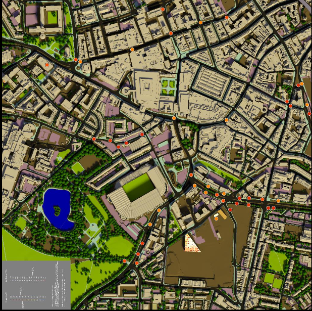

```{r setup, include=FALSE}
knitr::opts_chunk$set(include = TRUE)
knitr::opts_knit$set(root.dir= normalizePath('..'))
```

## Project Requirements

### Written Report Outline


What is the need for the project?

Justify your choice of response (i.e. the nature of, and your plan for, your project). To give strength to your argument you should reference to practice elsewhere (e.g. in academic literature, or industry practices)

Discuss and implementation of CRISP-DM

How successful has it been? Provide evidence, using appropriate evaluation methodologies, and comment on the strengths/weaknesses of your evidence in answering this question

What are the future implications for work in this area? If applicable, which areas of extension work are now possible due to the foundational work you have performed in this project?

A brief reflection on your personal and professional learning in undertaking this project. Here, you can comment on how you found the process, what you learned about the technologies and methodologies you used, which aspects you found most difficult/straightforward, and any conclusions which will inform the way you undertake similar projects in the future

### Structured Abstract

REMEMBER TO INCLUDE STRUCTURED ABSTRACT

### EDA Findings.

You should also produce additional documentation detailing the findings from your exploratory analysis. You are encouraged to make use of a literate programming framework, e.g. R Markdown, to align analytic code with narrative  tetx. You should submit the source file(s) for the notebooks as well as output saved in PDF Format. No limit on length for this document!

CRISP-DM Methodology:

## Business Understanding

### Determine Business Objectives

Background

Maybe include more background information on Newcastle University and data

With world-leading research in data, Newcastle University is always undertaking new challenges to advance the field. In order to keep up with ever-expanding amount of data produced by cities, one such challenge is to be able to effectively convey the information from this data to stakeholders. To address this issue, the University has created a terapixel image of the city of Newcastle upon Tyne, including environmental data such as temperature and humidity, from sensors across the city. This terapixel image contains over one trillion pixels and not only allows the entire city to be viewed, but is rendered at 12 different levels allowing users to zoom in whilst retaining full picture detail. However, rendering over one trillion pixels requires immense computing power, and so the University has made use of public cloud service *Microsoft Azure* to perform the rendering process. This facilitates a far quicker rendering process, which is more suitable for a primary requirement of the project - to ensure the terapixel image supports daily updates.

Business Objectives

Whilst Newcastle University has created this terapixel visualisation, it is important that the rendering process with cloud supercomputing is rigorously evaluated in order to identify any inefficiencies.  

Business Success Criteria

### Assess Situation

### Determine Data Mining Goals

### Produce Project Plan

## Data Understanding

```{r include=FALSE}
#load project
library(ProjectTemplate)
load.project()

```

```{r include=FALSE}
source("src/eda_plots.R")
```


Describe Data

In order to evaluate the rendering process, Newcastle University has provided three files detailing various aspects of a single run of the rendering process. The file "application.checkpoints.csv" has dimensions and variable names:

```{r}
dim(application.checkpoints)
colnames(application.checkpoints)
str(application.checkpoints)
```
Where the "eventType" can be either "START" or "STOP" to indicate the end of beginning of an event, and "eventName" can take the following values;

```{r}
unique(application.checkpoints$eventName)
```
In which "TotalRender" is a combination of all other events, which represent different parts of the whole rendering process. In addition to "eventType" and "eventName", "timestamp" gives the time associated with this event starting or stopping, "hostname" is the hostname of the virtual machine auto-assigned by the Azure batch system and "jobId" and "taskId" are the unique IDs of the Azure batch job and task, respectively.

The file "gpu.csv" has the following dimensions and variable names, with all variable values being of class character:

```{r}
dim(gpu)
colnames(gpu)
str(gpu)
```

The variable names "timestamp" and "hostname" have the same meaning as in "application.checkpoints.csv". "gpuSerial" and "gpuUUID" are the serial number and unique ID of the physical GPU card, which represent a one-to-one match the "hostname" variable. As there are 1024 gpu cores, there are 1024 different values for "hostname", "gpuSerial" and "gpuUUID". 

```{r}
length(unique(gpu$hostname))
length(unique(gpu$gpuSerial))
length(unique(gpu$gpuUUID))

dim(unique(gpu[c("hostname","gpuSerial","gpuUUID")]))
```

The additional variables in this data set are quantitative variables describing different aspects of the cores. These include "powerDrawWatt" (the power draw of the GPU in watts), "gpuTempC" (the temperature of the GPU in Celsius), "gpuUtilPerc" (the percent utilisation of the GPU core) and "gpuMemUtilPerc" (the percent utilisation of the GPU memory).

We can also observe that variables "timestamp", "hostname" and "gpuUUID" are of class character, whilst variables "gpuSerial" and "powerDrawWatt" are of class numeric. Lastly, variables "gpuTempC", "gpuUtilPerc" and "gpuMemUtilPerc" are integer values.

```{r}
str(gpu)
```

The final file that we will use is "task.x.y.csv". This file has the dimensions and variables:

```{r}
dim(task.x.y)
colnames(task.x.y)

```


Variables "jobId" and "taskId" are the same as in "application.checkpoints.csv", whilst "x" and "y" represent the location of each tile being rendered. The "Level" variable allows users to zoom into the visualisation. In total there are 12 levels, however only levels 12, 8 and 4 and rendered whilst the other levels are derived in the tiling process. Level 12 is when the the image at maximum zoom, and level 1 is when the image is zoomed right out. The "jobId" relates to the "Level" variable, so in total there are three different "jobId" values corresponding to the three levels that are rendered, as shown below:

```{r}
unique(task.x.y[c("jobId","level")])
```
We can also observe that the values in "taskId" and "jobId" are of class character, whilst the other variables are of class integer.

```{r}
str(task.x.y)
```


Data Quality

With the data described at a high level, it is necessary to assess the quality of it. First we can check for any missing values using the below code.

```{r}
sum(is.na(application.checkpoints))

sum(is.na(gpu))

sum(is.na(task.x.y))
```

As we are satisfied that there is no missing data, we can now check the data for duplicates.

```{r}
dim(application.checkpoints)[1] - dim(unique(application.checkpoints))[1]

dim(gpu)[1] - dim(unique(gpu))[1]

dim(task.x.y)[1] - dim(unique(task.x.y))[1]
```

We can see that there are 2,470 duplicates in "application.checkpoints.csv", 9 in "gpu.csv" and none in "task.x.y.csv". With no missing data and only a small percentage of the data in duplicate, the data is of good quality with respect to duplicates and missing data.

Although there is no missing data in the sense of NULL values, "gpu" has a significant population of outliers. We can observe this by plotting histograms for each quantitative variable in the data set. 

```{r echo=FALSE}
grid.arrange(gputemp_plot,gpupowerdraw_plot,gpuutil_plot,gpumemutil_plot,ncol = 2,nrow =2)
```

From the above histograms we can can observe significant noise in variables gpuUtilPerc, gpuMemUtilPerc and powerDrawWatt. Specifically, in gpuMemUtilPerc and gpuUtilPerc this noise is localised around 0. In the following section these outliers will be investigated and the data transformed into the a more suitable format for analysis.

## Data Preparation

In order to rigorously evaluate the supercomputer rendering process, it is important to examine all aspects of it. We will therefore use the data in all three files for our analysis. First of all, we will prepare the data in "application.checkpoints".

As the data in "application.checkpoints" is clean, we can proceed with using it to transform the data into a more useful format whilst deriving new attributes from it. To make the "timestamp" variable more meaningful, we can convert it from class character to datetime format, or POSIXct. As each value in "timestamp" is of the form "`r application.checkpoints$timestamp[1]`", we can use the below function to remove the letters "T" and "Z".

```{r eval = FALSE}
clean_date_time = function(string) {
  string_rep = str_replace(string, "T"," ")
  string_rep2 = str_replace(string_rep, "Z","")
  return(string_rep2)
}
```

Then, the resulting "timestamp" values are parsed into into POSIXct form, and the duplicates that were found in the *Data Understanding* section of this report are removed.

```{r eval = FALSE}

#apply clean_date_time function to date_time in data and create list
date_time_chr = lapply(application.checkpoints$timestamp,clean_date_time)

#create list of date-times converted to datetime format
date_time = parse_date_time(date_time_chr,"%Y%m%d %H%M%S")

#change timestamp to converted date_time format
app_data$timestamp = date_time

#remove duplicates
app_data = unique(app_data)

```

With the "timestamp" variable in a more computational-friendly format, we can now derive the runtime for each event. First, the data must be converted from long format to wide format with respect to the eventType variable. Then, the start time of the event can be subtracted from the stop time to calculate the runtime. This is performed with the below code.

```{r eval = FALSE}

#convert to wide format so that START and STOP are separate columns
app_wide = app_data %>%
  pivot_wider(names_from = eventType,
              values_from = timestamp)

#create runtime variable by calculating time difference from start to stop timestamp
app_wide$runtime = app_wide$STOP - app_wide$START

```

Using "runtime", we can check that the "TotalRender" runtime matches the summation of the runtimes for the other events by further widening the data to create a variable for each eventName, whilst also excluding variables "START" and "STOP" such that each observation in the data corresponds to an individual task. We will do this in a different data set called "event_data" to preserve the data pipeline which app_wide is integral to. A new variable "TotalProcess" is then created which is the summation of the runtimes for events Saving Config, Render, Tiling and uploading. Creating a new variable to observe the difference between the original "TotalRender" variable and our new  "TotalProcess" variable reveals that the runtime for "Tiling" is not captured in the "TotalRender" variable.

```{r eval=FALSE}
event_data = app_wide[c("eventName","runtime","taskId","hostname")] %>% 
  arrange(taskId) %>%
  pivot_wider(names_from = eventName,
              values_from = runtime)

event_data$totalprocess = event_data$Render + event_data$Uploading + 
  event_data$`Saving Config` + event_data$Tiling

event_data$diff = event_data$totalprocess - event_data$TotalRender
```

We can then confirm that the difference between the "TotalRender" and "TotalProcess" variables is almost identical to the runtime of "Tiling" with the below calculation.

```{r}
sum(as.numeric(event_data$diff))/sum(as.numeric(event_data$Tiling))
```

Therefore, we will apply the above transformations to the app_wide data in order to change the "TotalRender" event to reflect the true summation of runtimes. Once these have been applied, the data is converted back to long format with variable "eventName" whilst variables "START" and "STOP" are removed as they are not accurate for eventName "TotalRender". These steps are performed in the below code.

```{r eval=FALSE}
app_wide = app_wide[c("eventName","runtime","taskId","hostname","jobId")] %>%
  pivot_wider(names_from = eventName,
              values_from = runtime)

app_wide$TotalRender = app_wide$Render + app_wide$Uploading + app_wide$`Saving Config` + 
  app_wide$Tiling

app_wide = app_wide %>%
  pivot_longer(c("Render","Uploading","Saving Config","TotalRender","Tiling"),
               names_to = "eventName", values_to = "runtime" )

```


In order to view the interaction of the "runtime" variable with variables from other data sets, it would be useful to create a new data set that exclusively contains eventName "TotalRender", thus showing only the total runtime for each rendering task per virtual machine. To further enhance this data set and make it conducive to joining with the "gpu" data later in the analysis, a "task_no" variable will also be added, reflecting the chronological order that each rendering task is performed per virtual machine. These steps are performed using the following code:

```{r eval = FALSE}
totalrender_data = filter(app_wide,eventName == "TotalRender") %>%
  arrange(hostname,START)

unique_app_hostname = unique(totalrender_data$hostname)

task_no_per_host = lapply(unique_app_hostname,assign_tr_task)

task_no_per_host = unlist(task_no_per_host)

totalrender_data$task_no = task_no_per_host
```

In the above code, the totalrender_data is created by filtering app_wide where eventName is equal to "TotalRender", and then the data is arranged by the virtual machine hostname and the time that the task was started. A vector of all unique hostnames in the resulting data is created, which is then used as the basis of an operation to number each individual task per hostname, resulting in a list of lists that is unpacked and appended to the data. The code for function "assign_tr_task" is given below.

```{r eval = FALSE}
#returns task_no when totalrender_data is ordered for each virtual machine task
assign_tr_task = function(hostn) {
  host_no = sum(totalrender_data$hostname == hostn)
  return(1:host_no)
}
```

There are several issues with the data in "gpu" that we must address. Firstly, the values in the "timestamp" variable are in the same class and format as in the raw "application.checkpoints" file. As previously with "application.checkpoints", we take the same steps to transform this into a more meaningful and computationally compatible variable. We should also remove the duplicates from the data. With the "timestamp" values now of class POSIXct and duplicates removed, we can turn out attention to the outliers in the data. Whether these outliers should be retained in the data or not is dependent upon if they are meaningful or an error. We can now arrange gpu by the newly transformed variable "timestamp" and "hostname". The resulting data provides several new insights about the "gpu" data. Firstly, it shows that the "gpu" data is a series of a snapshot measurements for each virtual machine taken every 2 seconds. Secondly, it indicates that the 0 values in "gpu" are related to the periods on the virtual machine in between tasks. This can be best depicted using a plot of gpuMemUtilPerc vs Time.

```{r echo=FALSE}
zero_plot
```

In the above plot it is evident that the peaks correspond to when a task is performed on the virtual machine and computer memory is being used. For analysis on the GPU measurements whilst a task is being performed, clearly any observations with a value of 0 for the gpuMemUtilPerc and gpuUtilPerc variables should be removed. However, for an investigation into the efficiency of the task scheduling process we can use these observations to calculate the amount of time the virtual machine spends in between tasks, as well as other performance metrics of these periods.

First, we can prepare the data that will be used in conjunction with "totalrender_data" and "task.x.y" to evaluate the task rendering performance across various metrics. In order to join these data sets for the analysis we will create the variable "task_no" that will assign a task number to each observation within a single peak in our plot above such that the number of unique task numbers corresponds to the number of peaks for each virtual machine. This is performed for each unique hostname using the custom function "assign_task_no", that identifies a new task, or peak, when several criteria have been satisfied. These are if the previous two values in gpuMemUtilPerc are 0 and both the gpuMemUtilPerc and gpuUtilPerc values in the current row are non-zero. Once the "task_no" variable has been added to the data, we create a new data set called "gpu_summary" that groups the data by the hostname and task_no, then summarises by the mean of the different quantitative variables in the data.

```{r eval=FALSE}

unique_hostnames = unique(gpu_data$hostname)

task_no_gpu = lapply(unique_hostnames,assign_task_no)

task_no_gpu = unlist(task_no_gpu)

gpu_data$task_no = task_no_gpu

gpu_summary = gpu_data[gpu_data$gpuMemUtilPerc!=0,] %>%
  group_by(hostname,task_no,gpuSerial) %>%
  summarise(powerDraw = mean(powerDrawWatt),
            tempC = mean(gpuTempC),
            MemUtilPerc = mean(gpuMemUtilPerc),
            GpuUtilPerc = mean(gpuUtilPerc))
```


As the task.x.y data set contains no duplicates or missing values, there is no need for any cleaning of this data.

Integrate Data

With each data set reformatted and transformed as desired, we can commence merging them to derive additional interpretations from the data. To begin, we can combine our summarised data from "gpu_summary" with "totalrender_data". Before joining these data sets we can verify that the hostname and task_no are our primary and foreign keys.

```{r}
totalrender_data %>%
  count(hostname,task_no) %>%
  filter(n > 1)

gpu_summary %>%
  count(hostname,task_no) %>%
  filter(n > 1)

sum(totalrender_data$hostname == gpu_summary$hostname) == length(gpu_summary$hostname)

sum(totalrender_data$task_no == gpu_summary$task_no) == length(gpu_summary$hostname)
```

So we can join these data sets via these variables using the following code.


```{r eval=FALSE}
gpu_app_data = left_join(totalrender_data,gpu_summary, by = c("hostname","task_no")
```


Next, we can assign the metrics from "gpu_app_data" to each tile in the terapixel image by combining the data from "gpu_app_data" and "task.x.y". We can confirm that the variable "taskId" in "gpu_app_data" is both a primary key in this data set as well as a foreign key for "task.x.y".

```{r}
gpu_app_data %>%
  count(taskId) %>%
  filter(n > 1)

task.x.y %>%
  count(gpu_app_data$taskId)

task.x.y %>%
  count(gpu_app_data$taskId) %>%
  filter(n>1)
```

We can therefore join both data sets simply using the "taskId" variable with the below code:

```{r eval = FALSE}
all_data = left_join(gpu_app_data,task_data[c("taskId","x","y","level")],by = c("taskId"))
```


## Modelling


```{r include=FALSE}
source("src/dominant-events.R")
```


Create several graphs to view different interactions of data set

## Which event types dominate task runtimes?

Before comparing the runtimes of the different events in the app_wide data, it is important to examine the distribution of the runtimes for each event individually to evaluate how best to compare them. 

```{r echo=FALSE}
grid.arrange(tiling_runtime_hist,uploading_runtime_hist,saving_runtime_hist,render_runtime_hist,ncol = 2,nrow =2)
```

From the above plots we can observe some clear outliers for the "Uploading" event. Whilst the majority of the events have a runtime of around 1 second, there is a small peak at around 20 seconds. To establish whether we should include these values in our analysis, we can explore to see if they are an error or representative of a element of the rendering process. One avenue of investigation we could take would be to examine which virtual machines the high upload times occur on, to see if some virtual machines have issues executing the "Uploading" task. To check this  we find the number of virtual machines that have higher than 10 second runtimes for the uploading task, take the unique values of these and then view the virtual machine hostnames where this occurred more than twice. 

```{r}
length(app_wide[app_wide$eventName == "Uploading" & app_wide$runtime >10,]$hostname)

length(unique(app_wide[app_wide$eventName == "Uploading" & app_wide$runtime >10,]$hostname))

app_wide %>%
  filter(eventName == "Uploading" & runtime > 10) %>%
  count(hostname) %>%
  filter(n>2)

```

This indicates that there were 1079 observations in the data where the eventName was "Uploading" and the runtime was longer than 10 seconds. Of these observations, they occurred on 793 different virtual machines where the maximum number of repeated occurrences on the same virtual machine was 3 - which happened on 7 different virtual machines. With these observations, it is unlikely that the high runtimes for the "Uploading" task are caused by a faulty or under-performing virtual machine. An additional route we can investigate is if there are some particular attributes of the tiles that are being rendered that are conducive to a high upload time. We can display the tiles with high runtimes for the "Uploading" task with the following code. First we filter the app_wide data to preserve only "Uploading" events with a runtime greater than 10 seconds, then we join this with "task.x.y" using the "taskId" variable as the primary key,

```{r eval=FALSE}
high_uploading_runtime = filter(app_wide,runtime>10 & eventName == "Uploading") %>%
  left_join(task.x.y,by = c("taskId"))
```

Now, we can visualise the tile locations with a high runtime for the "Uploading" task.

```{r echo=FALSE}
uploading_runtime_plot
```

Evidently, the majority of these tiles are located where the y co-ordinate is approximately less than 25. These are also the tiles that are rendered at the beginning of the overall terapixel image rendering process, which can be shown by plotting the runtime of the "Uploading" event against the time at which the event commences.

```{r echo=FALSE}
grid.arrange(task_no_uploading,ncol =2)
```

From this we can surmise that there are some inefficiencies at the beginning of the terapixel rendering process that stem from the "Uploading" task taking upwards of 20 times longer than it does for the remainder of the process. 

First of all, we can use the app_wide data prepared in the previous section to examine the runtimes of different events. The below histogram shows the average runtime for each event in the app_wide data.

```{r echo=FALSE}
event_runtime_plot
```

Clearly, the rendering event dominates the overall process, followed by "Uploading", then "Tiling" and finally "Saving Config" takes very little time. This plot also depicts how the TotalRender eventName that we created in the previous section is a combination of all event runtimes.

### What is the interplay between GPU temperature and runtime performance?

```{r include=FALSE}
source("src/metric_correlations.R")
```


As each virtual machine has its own unique environment due to different GPU card, an analysis of the relationships between different variables should take this into consideration. Therefore, a comparison between temperature and runtime performance should only be made per virtual machine, as contrasting these variables across different GPU cards would not be fair. To examine the correlation between temperature and runtime for each of the 1024 virtual machines used to render the terapixel image, we can calculate the correlation coefficient for each virtual machine, and visualise the distribution. 

```{r}
corr_hist
```

The above histogram shows a range of correlation coefficients for the virtual machines, ranging from -0.13 to 0.82 with an average correlation coefficient for the whole data of `r format(round(mean(temp_vs_runtime_corr),2))`. A closer look at a plot of temperature vs runtime for the virtual machine with a negative correlation of -0.13 with the "task_no" variable labeling the points, indicates that the results from the first two tasks where the high uploading time discussed earlier in the analysis drives a far higher than average total render time. Additionally, in these tasks the temperature is significantly lower than average, which may due to the GPU heating up in the first few tasks. This plot can be viewed below.

```{r}
grid.arrange(weak_temp_corr,temp_vs_task, ncol = 2)
```

From the above plot we can observe that by removing the observations from the first two tasks, the plot would resemble a positive correlation as opposed to a negative. We can calculate this updated correlation coefficient with the below code using custom function "calculate_cor".

```{r}
calculate_corr(unique_hostnames[match(min(temp_vs_runtime_corr),temp_vs_runtime_corr)], "runtime","tempC",task_number = 2)
```

Therefore, with the removal of of the first two tasks in the data, the correlation coefficient has increased dramatically from -0.13 t0 0.34. We can recalculate the average correlation coefficient for all virtual machines in the data without the first two tasks with the following code.

```{r}
temp_vs_runtime_corr2 = lapply(unique_hostnames,calculate_corr,var1 = "runtime", var2 = "tempC", 
                               task_number = 2)

temp_vs_runtime_corr2 = unlist(temp_vs_runtime_corr2)

mean(temp_vs_runtime_corr2)
```

Therefore, for all tasks from the third onward there is a moderate positive correlation of 0.64 with minimum and maximum values of `r format(round(min(temp_vs_runtime_corr2),2))` and `r format(round(max(temp_vs_runtime_corr2),2))`, respectively. This indicates that the longer a task is ran for, the hotter the GPU becomes.  


### What is the interplay between increased power draw and render time?

```{r include=FALSE}
source("src/power_runtime.R")
```

Performing a similar analysis as in the previous section, we can calculate the correlation coefficient of the variables "powerDraw" and "runtime" for each individual virtual machine, still respecting the fact each virtual machine represents a unique environment. As before, we can view the distribution of correlation coefficients for these variables in a histogram.

```{r echo=FALSE}
power_corr_hist
```

The above plot shows that for all virtual machines, there exists a positive correlation between the runtime and the power draw of the GPU. The average correlation coefficient is `r format(round(mean(power_vs_runtime_corr)))`, indicating a moderate positive correlation, which varies with minimum and maximum correlation coefficient values of `r format(round(min(power_vs_runtime_corr)))` and `r format(round(max(power_vs_runtime_corr)))` respectively. This indicates that as the runtime of a task increases, so does the amount of power that is used.

### Can we quantify the variation in computation requirements for particular tiles?

```{r include=FALSE}
source("src/tile_variation.R")
```

Using "all_data" we can plot the tile co-ordinates and visualise the variation in computation requirements. Below depicts the variation in "runtime" for each tile.

```{r echo=FALSE}
tile_runtime_plot
```

```{r echo=FALSE}
tile_mem_plot
```

When comparing the above plot with the below final terapixel image, we can observe lower runtimes for the areas of the image with the same colour. In contrast, we can observe much higher runtimes for areas where render tracing has been used extensively to depict shadows. In addition, we can observe the high runtimes in the above plot corresponding to the first and second tasks that were discussed in previous sections.

```{r echo=FALSE}

```


### Can we identify particular GPU cards (based on their serial numbers) whose performance differs to other cards? (i.e. perpetually slow cards).

```{r include=FALSE}
source("src/gpu_analysis.R")
```


To identify GPU cards with distinct performance properties, we can summarise "all_data" by taking averages of each performance metric per virtual machine. However. it is worth recalling that the first two tasks performed on the majority of virtual machines exhibit behavior that is not representative of the GPU card performance in the remainder of the total rendering process. Taking this into consideration, we can create two data summaries from "all_data" providing the average performance metrics for each virtual machine. One data set will consider data from all tasks, whilst the second will exclude observations made in the first two tasks performed on each virtual machine. Using both of these data sets, we can identify GPU cards that express unusual properties and  verify that this is the case over all tasks and are not being heavily skewed by abnormalities in the first two.

The below plot depicts 15 different GPU cards with the highest average render time per tile. Moreover, it shows two averages, one calculated including the first two task observations and one without. 

```{r echo=FALSE}
slow_card_inc_plot
```

We can observe that for the majority of the GPU cards, the average total render time per tile increases with the inclusion of the first two tasks, however it is not a significant increase. Additionally, while the inclusion slightly alters the order of the 15 GPU cards with the highest average total render time per tile, it does not substantially change it and the slowest 15 GPU cards remain the slowest GPU cards regardless. The average increase when including observations from the first two tasks across all GPU cards is `r format(round(mean(avg_diff$runtime_diff),2))` so it does skew the averages slightly but not enough to cause a significant alteration in the data. 

We can now observe the distribution of the average total render time per tile for each GPU, calculated including the observations for the first two tasks.

```{r echo=FALSE}
ggplot(arrange(filter(slow_cards,runtime_env == "runtime_inc"))) + aes(x = avg_runtime) + 
  geom_histogram(bins = 20) + labs(
    x = "Average Total Render Time per Tile per GPU (seconds)",
    y = "Frequency"
  )
```

It is clear in the above plot that there are two main groups of GPU cards that differ in performance. One group with an average render time per tile of approximately 46 seconds, and the other with 42 seconds.


### What can we learn about the efficiency of the task scheduling process?

From our analysis of the "gpu" data, we found that this data set contains snapshots of each virtual machine every two seconds. This revealed periods between tasks where the GPU card was not being utilised. Whilst we used this previously to assign task numbers to each virtual machine tile rendering process, we can also use it to establish how efficient the task scheduling process is. The more efficiently the tasks or scheduled, the less time will be spent on the virtual machine between tasks, therefore we can investigate this by finding the proportion of observations where the gpuMemUtil and gpuUtilPerc variables are equal to 0 (indicating that a task is not running) from the beginning of the first task to the end of the final one. To do this, we can use the below function:

```{r eval = FALSE}
waiting_time_perc = function(hostn) {
  filt_data = filter(gpu_data,hostname == hostn & task_no != 0)
  last_task_ref = min(which(filt_data$task_no == max(filt_data$task_no) & filt_data$gpuMemUtilPerc == 0))-1
  filt_data = slice(filt_data,1:last_task_ref)
  perc_zero = sum(filt_data$gpuMemUtilPerc == 0 & filt_data$gpuUtilPerc == 0)/dim(filt_data)[1] *100
  return(perc_zero)
}
```

This function returns the percentage of observations where the gpuMemUtil and gpuUtilPerc variables are equal to 0 for a given virtual machine hostname. It does not count any observations taken before the beginning of the first task or after the final task has finished. We can apply this function to all 1024 virtual machines and visualise the distribution of the result.

```{r}
ggplot() + aes(x=vm_waiting_times) + geom_histogram(bins=30) + 
  labs(
    x = "Time Between Tasks (% of Total Time)",
    y = "Frequency"
  )
```

In addition to the distribution, the minimum and maximum percentages of time between tasks for a virtual machine are `r format(round(min(vm_waiting_times),1))` and `r format(round(max(vm_waiting_times),1))`, respectively. The mean average percentage is `r format(round(mean(vm_waiting_times),1))`. So on average, approximately a quarter of the total rendering time for the whole terapixel image is spent by a virtual machine waiting to be assigned the next task. 

The above plot resembles the histogram in the previous section showing the distribution of the average total render time per tile for each virtual machine. We can create a small data set to investigate whether average runtime correlates with average time spent waiting for a task to be assigned to the virtual machine by joining up the data and computing the correlation coefficient with the below code.

```{r}
vm_wait_data = as.data.frame(cbind("hostname" = unique_hostnames,vm_waiting_times)) %>%
  left_join(filter(slow_cards,runtime_env == "runtime_exc"),by = c("hostname"))

cor(as.numeric(vm_wait_data$vm_waiting_times),as.numeric(vm_wait_data$avg_runtime))
```

This indicates that there is a strong negative correlation between the average task runtime and the percentage of the total rendering process spent waiting for a task to be assigned for each virtual machine. Therefore, as the average runtime for a task increases, the time spent waiting for a task to be assigned decreases.


## Evaluation

## Deployment


