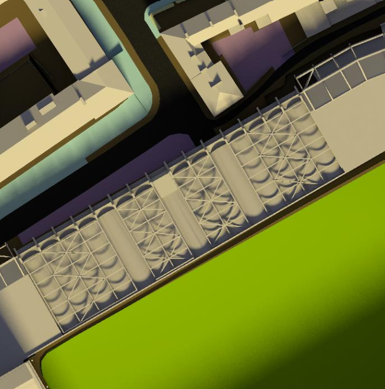

```{r setup, include=FALSE}
knitr::opts_chunk$set(include = TRUE)
knitr::opts_knit$set(root.dir= normalizePath('..'))
```

## Project Requirements

### Written Report Outline


What is the need for the project?

Justify your choice of response (i.e. the nature of, and your plan for, your project). To give strength to your argument you should reference to practice elsewhere (e.g. in academic literature, or industry practices)

Discuss and implementation of CRISP-DM

How successful has it been? Provide evidence, using appropriate evaluation methodologies, and comment on the strengths/weaknesses of your evidence in answering this question

What are the future implications for work in this area? If applicable, which areas of extension work are now possible due to the foundational work you have performed in this project?

A brief reflection on your personal and professional learning in undertaking this project. Here, you can comment on how you found the process, what you learned about the technologies and methodologies you used, which aspects you found most difficult/straightforward, and any conclusions which will inform the way you undertake similar projects in the future

### Structured Abstract

REMEMBER TO INCLUDE STRUCTURED ABSTRACT

### EDA Findings.

You should also produce additional documentation detailing the findings from your exploratory analysis. You are encouraged to make use of a literate programming framework, e.g. R Markdown, to align analytic code with narrative  tetx. You should submit the source file(s) for the notebooks as well as output saved in PDF Format. No limit on length for this document!

CRISP-DM Methodology:

## Business Understanding

### Determine Business Objectives

Background

Maybe include more background information on Newcastle University and data

With world-leading research in data, Newcastle University is always undertaking new challenges to advance the field. In order to keep up with ever-expanding amount of data produced by cities, one such challenge is to be able to effectively convey the information from this data to stakeholders. To address this issue, the University has created a terapixel image of the city of Newcastle upon Tyne, including environmental data such as temperature and humidity, from sensors across the city. This terapixel image contains over one trillion pixels and not only allows the entire city to be viewed, but is rendered at 12 different levels allowing users to zoom in whilst retaining full picture detail. However, rendering over one trillion pixels requires immense computing power, and so the University has made use of public cloud service *Microsoft Azure* to perform the rendering process. The use of this IaaS service enables two key objectives of the project to be fulfilled. Firstly, it enables the visualisation to be scaled at will by simply adding more nodes to the cloud supercomputer. Within the context of the project, this is important should more data from sensors be added or the Newcastle area depicted in the image require expansion. Secondly, this facilitates a far quicker rendering process, which ensures that the terapixel image can support daily updates. This is an equally vital feature to ensure that sensor data remains up-to-date.

Business Objectives

Whilst Newcastle University has created this terapixel visualisation, it is important that the rendering process with cloud supercomputing is rigorously evaluated in order to identify any inefficiencies. The aims of this analysis will be to thoroughly evaluate individual events performed as part of the total rendering process, explore the relationship between different performance metrics, identify GPU cards and tiles with unusual behavior and assess the efficiency of the task scheduling process.

Business Success Criteria

### Assess Situation


### Produce Project Plan

## Data Understanding

```{r include=FALSE}
#load project
library(ProjectTemplate)
load.project()

```

```{r include=FALSE}
source("src/eda_plots.R")
```


Describe Data

In order to evaluate the rendering process, Newcastle University has provided three files detailing various aspects of a single entire run of the rendering process. The file "application.checkpoints.csv" has dimensions and variable names and values all of class character:

```{r}
dim(application.checkpoints)
colnames(application.checkpoints)
str(application.checkpoints)
```
Where the "eventType" can be either "START" or "STOP" to indicate the end of beginning of an event, and "eventName" can take the following values;

```{r}
unique(application.checkpoints$eventName)
```
In which "TotalRender" is a combination of all other events, which represent different parts of the whole rendering process. In addition to "eventType" and "eventName", "timestamp" gives the time associated with this event starting or stopping, "hostname" is the hostname of the virtual machine auto-assigned by the Azure batch system and "jobId" and "taskId" are the unique IDs of the Azure batch job and task, respectively.

The file "gpu.csv" has the following dimensions and variable names:

```{r}
dim(gpu)
colnames(gpu)
str(gpu)
```

The variable names "timestamp" and "hostname" have the same meaning as in "application.checkpoints.csv". "gpuSerial" and "gpuUUID" are the serial number and unique ID of the physical GPU card, which represent a one-to-one match the "hostname" variable. As there are 1024 gpu cores in the cloud supercomputer, there are 1024 different values for "hostname", "gpuSerial" and "gpuUUID". 

```{r}
length(unique(gpu$hostname))
length(unique(gpu$gpuSerial))
length(unique(gpu$gpuUUID))

dim(unique(gpu[c("hostname","gpuSerial","gpuUUID")]))
```

Other variables in this data set are quantitative variables detailing various performance metrics of the GPU cores. These include "powerDrawWatt" (the power draw of the GPU in watts), "gpuTempC" (the temperature of the GPU in Celsius), "gpuUtilPerc" (the percent utilisation of the GPU core) and "gpuMemUtilPerc" (the percent utilisation of the GPU memory).

We can also observe that variables "timestamp", "hostname" and "gpuUUID" are of class character, whilst variables "gpuSerial" and "powerDrawWatt" are of class numeric. Lastly, variables "gpuTempC", "gpuUtilPerc" and "gpuMemUtilPerc" are integer values.

```{r}
str(gpu)
```

The final file that we will use is "task.x.y.csv". This file has the dimensions and variables:

```{r}
dim(task.x.y)
colnames(task.x.y)

```

Variables "jobId" and "taskId" are the same as in "application.checkpoints.csv", whilst "x" and "y" represent the location of each tile being rendered. The "Level" variable allows users to zoom into the visualisation. In total there are 12 levels, however only levels 12, 8 and 4 and rendered whilst the other levels are derived in the tiling process. Level 12 is when the the image is at maximum zoom, and level 1 is when the image is fully zoomed out. The "jobId" relates to the "Level" variable, so in total there are three different "jobId" values corresponding to the three levels that are rendered, as shown below:

```{r}
unique(task.x.y[c("jobId","level")])
```
We can also observe that the values in "taskId" and "jobId" are of class character, whilst the other variables are of class integer.

```{r}
str(task.x.y)
```


Data Quality

With the data described at a high level, we can check for any missing values using the below code.

```{r}
sum(is.na(application.checkpoints))

sum(is.na(gpu))

sum(is.na(task.x.y))
```

As we are satisfied that there is no missing data, we can now check the data for duplicates.

```{r}
dim(application.checkpoints)[1] - dim(unique(application.checkpoints))[1]

dim(gpu)[1] - dim(unique(gpu))[1]

dim(task.x.y)[1] - dim(unique(task.x.y))[1]
```

We can see that there are 2,470 duplicates in "application.checkpoints.csv", 9 in "gpu.csv" and none in "task.x.y.csv". With no missing data and only a small percentage of duplicate data, the data is of good quality.

Although there is no missing data in the sense of NULL values, "gpu" has a significant population of outliers. We can observe this by plotting histograms for each quantitative variable in the data set. 

```{r echo=FALSE}
grid.arrange(gputemp_plot,gpupowerdraw_plot,gpuutil_plot,gpumemutil_plot,ncol = 2,nrow =2)
```

From the above histograms we can can observe significant noise in variables gpuUtilPerc, gpuMemUtilPerc and powerDrawWatt. Specifically, in gpuMemUtilPerc and gpuUtilPerc this noise is localised around 0. In the following section these outliers will be investigated and the data transformed into the a more suitable format for analysis.

## Data Preparation

In order to rigorously evaluate the supercomputer rendering process, it is important to examine all aspects of it. We will therefore use the data in all three files for our analysis. First of all, we will prepare the data in "application.checkpoints".

As the data in "application.checkpoints" is clean, we can proceed with using it to transform the data into a more useful format whilst deriving new attributes from it. To make the "timestamp" variable more meaningful, we can convert it from class character to datetime format, or POSIXct. As each value in "timestamp" is of the form "`r application.checkpoints$timestamp[1]`", we can use the below function to remove the letters "T" and "Z".

```{r eval = FALSE}
clean_date_time = function(string) {
  string_rep = str_replace(string, "T"," ")
  string_rep2 = str_replace(string_rep, "Z","")
  return(string_rep2)
}
```

Then, the resulting "timestamp" values are parsed into into POSIXct form, and the duplicates that were found in the *Data Understanding* section of this report are removed.

```{r eval = FALSE}

#apply clean_date_time function to date_time in data and create list
date_time_chr = lapply(application.checkpoints$timestamp,clean_date_time)

#create list of date-times converted to datetime format
date_time = parse_date_time(date_time_chr,"%Y%m%d %H%M%S")

#change timestamp to converted date_time format
app_data$timestamp = date_time

#remove duplicates
app_data = unique(app_data)

```

With the "timestamp" variable in a more computation-friendly format, we can now derive the total runtime for each event. First, the data must be converted from long format to wide format with respect to the eventType variable. Note that the data is also arranged by START time, a step that will prove useful in our future data preparation. Then, the start time of the event can be subtracted from the stop time to calculate the runtime in seconds. This is performed with the below code.

```{r eval = FALSE}
#convert to wide format so that START and STOP are separate columns
app_wide = app_data %>%
  pivot_wider(names_from = eventType,
              values_from = timestamp) %>%
  arrange(hostname,START)

#create runtime variable by calculating time difference from start to stop timestamp
app_wide$runtime = as.numeric(app_wide$STOP - app_wide$START)

```

Using "runtime", we can check that the "TotalRender" runtime matches the summation of the runtimes for the other events by further widening the data to create a variable for each eventName, whilst also excluding variables "START" and "STOP" such that each observation in the data corresponds to an individual task. We will do this in a different data set called "event_data" to preserve the data pipeline which app_wide is integral to. A new variable, "TotalProcess", is then created which is the summation of the runtimes for events Saving Config, Render, Tiling and Uploading. Creating a new variable, "diff", to observe the difference between the original "TotalRender" variable and"TotalProcess", reveals that the runtime for "Tiling" is not captured in the "TotalRender" variable.

```{r eval=FALSE}
event_data = app_wide[c("eventName","runtime","taskId","hostname")] %>% 
  arrange(taskId) %>%
  pivot_wider(names_from = eventName,
              values_from = runtime)

event_data$totalprocess = event_data$Render + event_data$Uploading + 
  event_data$`Saving Config` + event_data$Tiling

event_data$diff = event_data$totalprocess - event_data$TotalRender
```

We can then confirm that the difference between the "TotalRender" and "TotalProcess" variables is almost identical to the runtime of "Tiling" with the below calculation.

```{r}
sum(as.numeric(event_data$diff))/sum(as.numeric(event_data$Tiling))
```

However, a look at the timeline of event executions for a single task reveals that the "Uploading" and "Tiling" events are initialised concurrently. 

```{r}
app_wide[app_wide$taskId == unique(app_wide$taskId)[1], c("eventName","START","STOP","runtime")]
```

Due to this, the runtime of "TotalRender" will not be equal to the summation of the runtimes for the other events. To verify that "Uploading" and "Tiling" are initialised at the same time for all rendering tasks in the file, we can widen the data to view only these events and their respective start time for each task. By then adding a new column that calculates the difference between each start time, we compute a vector of all differences.

```{r eval=FALSE}
event_diff = filter(app_wide,eventName %in% c("Uploading","Tiling")) %>%
  select(eventName,taskId,START) %>%
  pivot_wider(names_from = eventName,
              values_from = START) %>%
  mutate(start_diff = Uploading - Tiling)

event_start_diff = as.numeric(event_diff$start_diff)
```

In viewing the distribution of this difference vector, it is clear that the differences between the start times for "Uploading" and "Tiling" are negligible. The largest difference between the two start times over the whole data is around 0.16 seconds, while the majority of differences are distributed heavily around 0.01 seconds. Therefore, it is fair to assume that they are initialised at the same time for every task.

```{r echo=FALSE}
ggplot() + aes(event_start_diff) + geom_boxplot() + labs(
  x = "Seconds",
  title = "Difference in Start Time of Uploading and Tiling Event for Each Task "
)
```

In order to view the interaction of the "runtime" variable with variables from other data sets, it would be useful to create a new data set that exclusively contains eventName "TotalRender", thus showing only the total runtime for each rendering task per virtual machine. To further enhance this data set and make it conducive to joining with the "gpu" data later in the analysis, a "task_no" variable will also be added, reflecting the chronological order that each rendering task is performed per virtual machine. These steps are performed using the following code:

```{r eval = FALSE}
totalrender_data = filter(app_wide,eventName == "TotalRender")

unique_app_hostname = unique(totalrender_data$hostname)

task_no_per_host = lapply(unique_app_hostname,assign_tr_task)

task_no_per_host = unlist(task_no_per_host)

totalrender_data$task_no = task_no_per_host
```

In the above code, the totalrender_data is created by filtering app_wide where eventName is equal to "TotalRender". In the earlier data preparation of "app_wide", the data was arranged by the "START" and "hostname" variables, so the data in the totalrender_data will still be in this order. A vector of all unique hostnames in the resulting data is created, which is then used as the basis of an operation to number each individual task per hostname, resulting in a list of lists that is unpacked and appended to the data. The code for function "assign_tr_task" is given below.

```{r eval = FALSE}
#returns task_no when totalrender_data is ordered for each virtual machine task
assign_tr_task = function(hostn) {
  host_no = sum(totalrender_data$hostname == hostn)
  return(1:host_no)
}
```

There are several issues with the data in "gpu" that we must address. Firstly, the values in the "timestamp" variable are in the same class and format as in the raw "application.checkpoints" file. As previously with "application.checkpoints", we take the same steps to transform this into a more meaningful and computationally compatible variable. We should also remove the duplicates from the data. With the "timestamp" values now of class POSIXct and duplicates removed, we can turn out attention to the outliers in the data. Whether these outliers should be retained in the data or not is dependent upon if they are meaningful or an error. We can now arrange gpu by the newly transformed variable "timestamp" and "hostname". The resulting data provides several new insights about the "gpu" data. Firstly, it shows that the "gpu" data is a series of a snapshot measurements for each virtual machine taken every 2 seconds.

Secondly, it indicates that the observations where gpuMemUtilPerc have a value of 0 are related to the periods on the virtual machine in between tasks. This can be best depicted using a plot of gpuMemUtilPerc vs Time on a single virtual machine.

```{r echo=FALSE}
zero_plot
```

In the above plot it is evident that the peaks correspond to when a task is performed on the virtual machine and computer memory is being used. For analysis on the GPU measurements whilst a task is being performed, clearly any observations with a value of 0 for the gpuMemUtilPerc and gpuUtilPerc variables should be removed. However, for an investigation into the efficiency of the task scheduling process we can use these observations to calculate the amount of time the virtual machine spends in between tasks, as well as other performance metrics from these periods.

In order to evaluate the task rendering performance across various metrics, we need to combine the data from all three data sets. To facilitate this, we will create the variable "task_no" in "gpu_data" that will assign a task number to each observation within a single peak in our plot above, such that the number of unique task numbers corresponds to the number of peaks for each virtual machine. This is performed for each unique hostname using the custom function "assign_task_no", that identifies a new task, or peak, when several criteria have been satisfied. These are if the previous two values in gpuMemUtilPerc are 0 and both the gpuMemUtilPerc and gpuUtilPerc values in the current row are non-zero. Once the "task_no" variable has been added to the data, we create a new data set called "gpu_summary" that groups the data by the hostname and task_no, then summarises by the arithmetic mean of the different quantitative variables in the data per hostname per task number.


```{r eval=FALSE}

unique_hostnames = unique(gpu_data$hostname)

task_no_gpu = lapply(unique_hostnames,assign_task_no)

task_no_gpu = unlist(task_no_gpu)

gpu_data$task_no = task_no_gpu

gpu_summary = gpu_data[gpu_data$gpuMemUtilPerc!=0,] %>%
  group_by(hostname,task_no,gpuSerial) %>%
  summarise(powerDraw = mean(powerDrawWatt),
            tempC = mean(gpuTempC),
            MemUtilPerc = mean(gpuMemUtilPerc),
            GpuUtilPerc = mean(gpuUtilPerc))
```


As the task.x.y data set contains no duplicates or missing values, there is no need to clean any of this data.

Integrate Data

With each data set reformatted and transformed as desired, we can commence merging them to derive additional interpretations from the data. To begin, we can combine our summarised data from "gpu_summary" with "totalrender_data". Before joining these data sets we can verify that the hostname and task_no are our primary and foreign keys.

```{r}
totalrender_data %>%
  count(hostname,task_no) %>%
  filter(n > 1)

gpu_summary %>%
  count(hostname,task_no) %>%
  filter(n > 1)

sum(totalrender_data$hostname == gpu_summary$hostname) == length(gpu_summary$hostname)

sum(totalrender_data$task_no == gpu_summary$task_no) == length(gpu_summary$hostname)
```

So the hostnames and task numbers for both data sets are an exact match, and we can join them via these variables using the following code.

```{r eval=FALSE}
gpu_app_data = left_join(totalrender_data,gpu_summary, by = c("hostname","task_no")
```

Next, we can assign the metrics from "gpu_app_data" to each tile in the terapixel image by combining the data from "gpu_app_data" and "task.x.y". We can confirm that the variable "taskId" in "gpu_app_data" is both a primary key in this data set as well as a foreign key for "task.x.y".

```{r}
gpu_app_data %>%
  count(taskId) %>%
  filter(n > 1)

task.x.y %>%
  count(gpu_app_data$taskId)

task.x.y %>%
  count(gpu_app_data$taskId) %>%
  filter(n>1)
```

We can therefore join both data sets simply using the "taskId" variable with the below code:

```{r eval = FALSE}
all_data = left_join(gpu_app_data,task_data[c("taskId","x","y","level")],by = c("taskId"))
```

With all data sets combined, we can begin analysis of the whole rendering process.

## Modelling


```{r include=FALSE}
source("src/dominant-events.R")
```


### Which event types dominate task runtimes?

Before comparing the runtimes of the different events in the app_wide data, it is important to examine the distribution of the runtimes for each event individually to evaluate how best to compare them. 

```{r echo=FALSE}
grid.arrange(tiling_runtime_hist,uploading_runtime_hist,saving_runtime_hist,render_runtime_hist,ncol = 2,nrow =2)
```

From the above plots we can observe some clear outliers for the "Uploading" event. Whilst the majority of the events have a runtime of around 1 second, there is a small peak at around 20 seconds. To gain a deeper understanding of the data, it would be helpful to investigate what could be causing these disproportionately high runtimes. One possible avenue of investigation is to examine which virtual machines the high upload times occur on, to see if some virtual machines have issues executing the "Uploading" task.To check this  we find the number of virtual machines that have higher than 10 second runtimes for the uploading task, take the unique values of these and then view the virtual machine hostnames with more than two occurrences. 

```{r}
length(app_wide[app_wide$eventName == "Uploading" & app_wide$runtime >10,]$hostname)

length(unique(app_wide[app_wide$eventName == "Uploading" & app_wide$runtime >10,]$hostname))

app_wide %>%
  filter(eventName == "Uploading" & runtime > 10) %>%
  count(hostname) %>%
  filter(n>2)

```

This indicates that there were 1079 observations in the data with eventName "Uploading" and a runtime longer than 10 seconds. Of these observations, they occurred on 793 different virtual machines where the maximum number of repeated occurrences on the same virtual machine was 3 - which happened on 7 different virtual machines. With these outliers occurring on 77% of all virtual machines, it is unlikely that the high runtimes for the "Uploading" task are caused by a faulty or under-performing virtual machine. An additional route we can investigate is if there are particular attributes of the tiles that are being rendered that are conducive to a high upload time. We can display the tiles with high runtimes for the "Uploading" task with the following code. First we filter the app_wide data to preserve only "Uploading" events with a runtime greater than 10 seconds, then we join this with "task.x.y" using the "taskId" variable as the primary key. 

```{r eval=FALSE}
high_uploading_runtime = filter(app_wide,runtime>10 & eventName == "Uploading") %>%
  left_join(task.x.y,by = c("taskId"))
```

Now, we can visualise the tile locations with a high runtime for the "Uploading" task.

```{r echo=FALSE}
uploading_runtime_plot
```

We calculate that `r format(round(dim(filter(high_uploading_runtime,y<25))[1]/dim(high_uploading_runtime)[1]*100,2))`% of these tiles are located where the y co-ordinate is approximately less than 25. These are the tiles that are rendered at the beginning of the overall terapixel image rendering process. To evidence this, we can enhance "high_uploading_runtime" with the addition of the corresponding task number for each observation. Once again using the "taskId" as the primary key, we can assign each individual observation a task number using "all_data".

```{r eval=FALSE}
high_uploading_runtime = filter(app_wide,runtime>10 & eventName == "Uploading") %>%
  left_join(task.x.y,by = c("taskId")) %>%
  left_join(all_data[c("taskId","task_no")], by = c("taskId"))
```

Now, by plotting the distribution of the "task_no" we can see that it is heavily dominated by tasks 1 and 2. Indeed, tasks 1 and 2 constitute `r format(round(dim(filter(high_uploading_runtime,task_no<3))[1]/dim(high_uploading_runtime)[1]*100,2))`% of the total outlier data. From both the previous plot and the below, it is clear that the remaining outliers not in tasks 1 and 2 are varied both in terms of the task number and tile in which they occur. As these account for only `r format(round(dim(filter(high_uploading_runtime,task_no>2))[1]/65793*100,2))`% of the total tasks, they will not be investigated further in this analysis.

```{r echo=FALSE}
task_no_uploading
```

From this we can surmise that there are inefficiencies at the beginning of the terapixel rendering process that stem from the "Uploading" task runtime being significantly longer than it is during the remainder of the total process. To quantify this more precisely, after joining the "task_no" variable to "app_wide" from "totalrender_data" by using "taskId" as the primary key, we can compare the average runtime for the "Uploading" event of the first two tasks to the rest of the tasks. 

```{r}
#arithmetic mean of runtime for "uploading" in first two tasks.
mean(filter(app_wide, task_no < 3 & eventName == "Uploading")$runtime)

#arithmetic mean of runtime "uploading" in tasks excluding first two.
mean(filter(app_wide, task_no > 2 & eventName == "Uploading")$runtime)

```

Therefore, the runtime for the "Uploading" event is on average `r format(round((mean(filter(app_wide, task_no < 3 & eventName == "Uploading")$runtime)/mean(filter(app_wide, task_no > 2 & eventName == "Uploading")$runtime)-1)*100,2))`% longer in the first two tasks than in the remaining. To determine exactly how many virtual machines this occurs on, we can find the number of virtual machines that have a runtime higher than the average "Uploading" runtime for all tasks excluding the first two. 

```{r}

runtime_average = mean(filter(app_wide, task_no > 2 & eventName == "Uploading")$runtime)

length(unique(filter(app_wide, task_no == 1 & 
                       eventName == "Uploading" & runtime > runtime_average)$hostname))

length(unique(filter(app_wide, task_no == 2 & 
                       eventName == "Uploading" & runtime > runtime_average)$hostname))

```

So in tasks 1 and 2, 882 and 801 virtual machines have longer than average runtimes for the "uploading event", corresponding to `r format(round(882/1024*100,2))`% and `r format(round(801/1024*100,2))`% of the total virtual machines in the cloud supercomputer. 

We can perform similar calculations on the "TotalRender" task to assess how the total render time of each task this is impacted by the high uploading times.

```{r}
#arithmetic mean of runtime for "TotalRender" in first two tasks.
mean(filter(app_wide, task_no < 3 & eventName == "TotalRender")$runtime)

#arithmetic mean of runtime "TotalRender" in tasks excluding first two.
mean(filter(app_wide, task_no > 2 & eventName == "TotalRender")$runtime)
```

So the TotalRender variable is only `r format(round((mean(filter(app_wide, task_no < 3 & eventName == "TotalRender")$runtime)/mean(filter(app_wide, task_no > 2 & eventName == "TotalRender")$runtime)-1)*100,2))`% longer on average during the first two tasks compared to the rest. Whilst this increase is not huge, it is a point to consider both in the remainder of this analysis and for future implementation of this cloud architecture. A primary goal of this project is to ensure the scalability of the process, and whilst an increase of this magnitude when individual task runtimes are on average less than a minute is small, if these were substantially increased this inefficiency would be far more impactful. The results of the above analysis can be summarised in the following plot, showing the change in average runtime for each event and task. 

```{r echo=FALSE}
ggplot(app_wide, aes(task_no, runtime, color = eventName)) +
  stat_summary(fun = mean, geom = "line") + 
  stat_summary(fun = mean, geom = "point") + 
  labs(
    x = "Task Number",
    y = "Average Runtime (seconds)",
    title = "Average Runtime vs Task Number for each Event",
    color = "Event"
  )
```


This is an important plot to consider when comparing the runtimes for different events, as the arithmetic mean runtime for the "Uploading" event will be skewed due to the outliers primarily located in tasks 1 and 2. Due to the median being far more robust against outliers, it would be a more appropriate metric in comparing the central tendency of each event runtime. The median will also reflect a runtime more representative of the "Uploading" event in the majority of tasks. The below bar chart depicts the median task runtime for each event. 


```{r echo=FALSE}
event_runtime_plot
```

Clearly, "Render" dominates the overall process. This is followed by "Uploading", which is only `r format(round((event_plot_data[event_plot_data$eventName == "Uploading",]$runtime/event_plot_data[event_plot_data$eventName == "Tiling",]$runtime - 1)*100,2))`% longer than "Tiling". Finally, "Saving Config" takes almost no time at all. An important point to consider with regards to the above plot, however, is that in the previous section we proved that the "Uploading" and "Tiling" events are initialised simultaneously. Therefore, only the event with the longer runtime will contribute to the overall total rendering time for each tile. By calculating the difference in render time for each "Uploading" and "Tiling" event per task, we can see the "Uploading" event is longer than "Tiling" every time. Therefore, the "Tiling" event does not contribute to the overall runtime of the total terapixel rendering process. The code that verifies this is given below:

```{r}
runtime_diff = filter(app_wide,eventName %in% c("Uploading","Tiling")) %>%
  select(eventName,taskId,runtime) %>%
  pivot_wider(names_from = eventName,
              values_from = runtime) %>%
  mutate(diff = Uploading - Tiling)


sum(runtime_diff$diff > 0)/dim(runtime_diff)[1]
```


### What is the interplay between GPU temperature and runtime performance?

```{r include=FALSE}
source("src/metric_correlations.R")
```

As each virtual machine has a different GPU card, an analysis of the relationships between different variables should take this into consideration. For instance, a card that is perpetually cooler than most other cards, may still increase in temperature as task runtime increases, but will do so on a different scale incomparable to other GPU cards. Therefore, a comparison between temperature and runtime performance should only be made per virtual machine. To examine the correlation between temperature and runtime for each of the 1024 virtual machines used to render the terapixel image, we can calculate the correlation coefficient between both variables for each virtual machine, and visualise the distribution. 

```{r echo=FALSE}
corr_hist
```

As the above histogram shows that these correlation coefficients are normally distributed, we may apply parametric techniques in the analysis of them. Moreover, due to each correlation coefficient being calculated from samples of various size, different weights will need to be assigned to them within these calculations. The weighted arithmetic mean of the above distribution is `r format(round(weighted.mean(temp_vs_runtime_corr,as.numeric(vm_weights)),2))` with a weighted standard deviation of `r format(round(weighted.sd(temp_vs_runtime_corr,as.numeric(vm_weights)),2))`. Whilst these indicate a mostly positive correlation between these variables, the weighted standard deviation shows a large degree of spread and this is echoed by the above distribution, with correlation coefficient values ranging from -0.13 to 0.82. The above histogram also supports our approach of assessing this relationship per virtual machine, as the correlation coefficient taken of both variables over the whole data set is `r format(round(cor(all_data$runtime,all_data$tempC),2))`, which is clearly not representative of the distribution shown above.

To more closely examine the causes of this variance, we can create at a scatter plot of temperature vs runtime, with the task number labeled, for the virtual machine with a negative correlation of -0.13. Additionally, we can also visualise the average temperature for each task number.

```{r echo=FALSE}
grid.arrange(weak_temp_corr,temp_vs_task, ncol = 2)
```


The above plots indicate that the negative correlation between temperature and runtime for this virtual machine is primarily driven by the first two tasks in the rendering process. As discussed in the previous section of this report, the first two tasks in the total rendering process have disproportionately high uploading times, which consequently gives many of the virtual machines longer than normal total rendering runtimes. This is then compounded by a lower than average temperature for the first 3 tasks in the total rendering process that can be seen for all GPU cards, presumably as they heat up. For the virtual machine above, this gives the impression that as the runtime decreases, the temperature increases, but this is a special case for the first two tasks and not representative of the remainder of the rendering process. To evidence this, we can recalculate the correlation coefficient for the virtual machine, while excluding the observations for the first two tasks. This is performed in the below code using custom function "calculate_corr".

```{r}
calculate_corr(unique_hostnames[match(min(temp_vs_runtime_corr),
                                      temp_vs_runtime_corr)], 
               "runtime","tempC",task_number = 2)
```

Therefore, with the removal of of the first two tasks in the data, the correlation coefficient for this virtual machine has increased dramatically from -0.13 t0 0.34. To see if this result is repeated for all virtual machines, We can recalculate the correlation coefficients for all virtual machines in the data without the first two tasks, using the following code:

```{r}
temp_vs_runtime_corr2 = lapply(unique_hostnames,calculate_corr,var1 = "runtime", var2 = "tempC", 
                               task_number = 2)

temp_vs_runtime_corr2 = unlist(temp_vs_runtime_corr2)

```

We can now compare the correlation coefficient distributions with the inclusion and exclusion of the first two tasks for all virtual machines.

```{r echo=FALSE}
grid.arrange(corr_hist,corr_hist2, nrow = 2)

```

Clearly, the correlation coefficients calculated when omitting observations from the first two tasks are significantly more positive. The weighted mean of this distribution is `r format(round(weighted.mean(temp_vs_runtime_corr2,as.numeric(vm_weights)),2))` with a weighted standard deviation of `r format(round(weighted.sd(temp_vs_runtime_corr2,as.numeric(vm_weights)),2))`. This shows the correlation coefficients are far more positive with much less variance, indicating that the first two tasks had a substantial effect in negatively skewing the correlation coefficients in the previous calculations. As the first two tasks only constitute `r format(round(2/mean(as.numeric(vm_weights))*100,2))`% of the average total amount of tasks performed on each virtual machine, we can say for the vast majority of the time there is a moderate positive correlation between temperature and runtime. This suggests that as the runtime of a task increases, so will the temperature of the GPU, and vice versa.


### What is the interplay between increased power draw and render time?

```{r include=FALSE}
source("src/power_runtime.R")
```

We can approach this analysis in the same way as in the previous section, by calculating the correlation coefficient for the power draw and render time for each virtual machine. This method takes into account that  each virtual machine represents a unique environment and may have different power consumption properties. As before, we can view the distribution of correlation coefficients for these variables in a histogram. Additionally, we can recalculate the correlation coefficients when exempting observations from the first two tasks to assess if these negatively skew the results as they did in the previous section.

```{r echo=FALSE}
grid.arrange(power_corr_hist,power_corr_hist2,nrow=2)
```

The above plots indicate that for all virtual machines in both scenarios, there exists a positive correlation between the runtime and the power draw of the GPU. Compared to our previous analysis of the interplay between temperature and runtime, the first two tasks have a limited impact in skewing the results. As both distributions are normal, we may use parametric techniques to support this assertion with quantitative assessments. The weighted mean and standard deviation of the correlation distribution with all observations are `r format(round(weighted.mean(power_vs_runtime_corr,as.numeric(vm_weights)),2))` and `r format(round(weighted.sd(power_vs_runtime_corr,as.numeric(vm_weights)),2))`, respectively. Likewise, for the correlation distribution where the first two tasks are excluded, the weighted mean and standard deviation are 
`r format(round(weighted.mean(power_vs_runtime_corr2,as.numeric(vm_weights)),2))` and `r format(round(weighted.sd(power_vs_runtime_corr2,as.numeric(vm_weights)),2))`, respectively. We can therefore see that observations from the first two tasks do negatively skew the distribution and increase the variance, however in this case the magnitude of this effect is minimal. In both scenarios, however, we can observe a moderate positive correlation between power draw and render time, suggesting that as one of these variables increases, so will the other.

Another interesting facet of the interplay between these variables, is that it seems far more consistent over all virtual machines. When calculating the correlation coefficient using all of the data rather than per virtual machine for variables temperature and runtime, we observed a far reduced correlation coefficient than the weighted mean average of the correlation coefficients per virtual machine. This was reflective of the large range of different temperatures and runtimes across various virtual machines. In the case of variables power draw and runtime, the correlation coefficient calculated for these variables is `r format(round(cor(all_data$runtime,all_data$powerDraw),2))`. This value is far more representative of the above distributions and indicates that the values involved in this interplay are more consistent across different virtual machines than the temperature values.


### Can we quantify the variation in computation requirements for particular tiles?

```{r include=FALSE}
source("src/tile_variation.R")
```

Before quantifying the variation in the computation requirements for different tiles, we should visualise the distribution for each performance metric to determine which techniques can be implemented in our calculations.

```{r echo=FALSE}
grid.arrange(top = "Performance Metric Distributions", runtime_hist,temp_hist,power_hist,mem_hist,gpu_hist,nrow=2,ncol=3)
```

Clearly, each variable is normally distributed with no obvious outliers, so we may use parametric techniques to quantify their variation. The below table details the mean, standard deviation and coefficient of variation for each variable.

```{r echo=FALSE}
knitr::kable(performance_metric_table, col.names=c("Metric", "Mean", "Standard Deviation","Coefficient of Variation"), align = "c", digits=2,"simple")
```

Using the coefficient of variation as the basis to compare different variable variances, it is evident that the variables "runtime", "powerDraw" and "MemUtilPerc" vary the most across different tiles. Having said this, objectively the variation across the tiles is limited, with the maximum coefficient of variation being 0.15.

To gain a more intuitive understanding of which particular tiles display the most variation in computation requirements, we can plot the x and y co-ordinates of each tile, and use colour to highlight the variation of a chosen variable. The below plots depict the variation of runtime, % Memory Usage and Power Draw across the tiles in the terapixel image.


```{r echo=FALSE, out.width = "70%",out.height= "50%",fig.align = 'center'}
tile_runtime_plot
```
```{r echo=FALSE, out.width = "70%",out.height= "50%",fig.align = 'center'}
tile_mem_plot
```
```{r echo=FALSE, out.width = "70%",out.height= "50%",fig.align = 'center'}
tile_power_plot
```

In the above plots a divergent colour scale is used to highlight particular areas that are substantially above and below the average value for that variable. A clear trend in all three plots is that the areas with less computational requirements are the same. For the plots of runtime and power draw, this supports our earlier conclusion of a positive correlation between both variables, and provides evidence that the same is true with these variables and % Memory Usage. As these plots provide renderings of the terapixel image, but rotated anti-clockwise by 90 degrees, we will perform the same transformation to the final terapixel image and cross-reference them. 


```{r echo=FALSE, out.width = "40%",out.height= "40%", fig.align = 'center'}
knitr::include_graphics("images/full_terapixel_image.png")
```


When comparing the final image with the plots depicting performance metric variation, we can observe lower computational requirements for the large areas of the image of the same colour. In contrast, we can observe much higher runtimes for areas where render tracing has been used extensively to depict shadows. A particular area of note in this case in the above runtime plot is around (100,100), which renders the part of the terapixel image shown below.


```{r echo=FALSE, out.width = "40%",out.height= "40%", fig.align = 'center'}

```


In addition, we can observe the high runtimes in the runtime plot corresponding to the first and second tasks that were discussed in previous sections.


### Can we identify particular GPU cards (based on their serial numbers) whose performance differs to other cards? (i.e. perpetually slow cards).

```{r include=FALSE}
source("src/gpu_analysis.R")
```


To identify GPU cards with distinct performance properties, we can summarise "all_data" by taking averages of each performance metric per virtual machine. However. it is worth recalling that the first two tasks performed on the majority of virtual machines exhibit behavior that is not representative of the GPU card performance over the remainder of the total rendering process. Taking this into consideration, we can create two data summaries from "all_data" providing the average performance metrics for each virtual machine. One data set will consider data from all tasks, whilst the second will exclude observations made in the first two tasks performed on each virtual machine. Using both of these data sets, we can identify GPU cards that express unusual properties and  verify that this is the case over all tasks and are not just being heavily skewed by abnormalities in the first two.

The below plot depicts 15 different GPU cards with the highest average render time per tile, in descending order by the average including observations from the first two tasks. It shows two averages, one calculated including the first two task observations and one without. 

```{r echo=FALSE}
slow_card_inc_plot
```

We can observe that for the majority of the GPU cards, the average total render time per tile increases , on average, by `r format(round(mean(avg_diff$runtime_diff),2))` seconds with the inclusion of the first two tasks. Therefore, these observations do skew the averages slightly but not enough to cause a significant alteration in the data. Additionally, while the inclusion slightly alters the order of the 15 GPU cards with the highest average total render time per tile, these cards still remain the slowest of the 1024 total GPU cards. 

We can also observe the distribution of the average total render time per tile for each GPU, calculated including the observations for the first two tasks. It is clear in the below plot that there are two main groups of GPU cards that differ in runtime performance.


```{r echo=FALSE}
ggplot(arrange(filter(slow_cards,runtime_env == "runtime_inc"))) + aes(x = avg_runtime) + 
  geom_histogram(bins = 20) + labs(
    x = "Average Total Render Time per Tile per GPU (seconds)",
    y = "Frequency"
  )
```


### What can we learn about the efficiency of the task scheduling process?

From our analysis of the "gpu" data, we found that this data set contains snapshots of each virtual machine every two seconds. This revealed periods between tasks where the GPU card was not being utilised. Whilst we used this previously to assign task numbers to each virtual machine tile rendering process, we can also use it to establish how efficient the task scheduling process is. The more efficiently the tasks are scheduled, the less time each virtual machine will spend not running in between tasks. Therefore, we can investigate this by finding the proportion of observations where the gpuMemUtil and gpuUtilPerc variables are equal to 0 (indicating that a task is not running) from the beginning of the first task to the end of the final one. To do this, we can use the below function:

```{r eval = FALSE}
waiting_time_perc = function(hostn) {
  filt_data = filter(gpu_data,hostname == hostn & task_no != 0)
  last_task_ref = min(which(filt_data$task_no == max(filt_data$task_no) & filt_data$gpuMemUtilPerc == 0))-1
  filt_data = slice(filt_data,1:last_task_ref)
  perc_zero = sum(filt_data$gpuMemUtilPerc == 0 & filt_data$gpuUtilPerc == 0)/dim(filt_data)[1] *100
  return(perc_zero)
}
```

This function returns the percentage of observations where the gpuMemUtil and gpuUtilPerc variables are equal to 0 for a given virtual machine hostname. It does not count any observations taken before the beginning of the first task or after the final task has finished. We can apply this function to all 1024 virtual machines and visualise the distribution of the result.

```{r echo=FALSE}
ggplot() + aes(x=vm_waiting_times) + geom_histogram(bins=30) + 
  labs(
    x = "Time Between Tasks (% of Total Time)",
    y = "Frequency"
  )
```

In addition to the distribution, the minimum and maximum percentages of time between tasks for a virtual machine are `r format(round(min(vm_waiting_times),1))` and `r format(round(max(vm_waiting_times),1))`, respectively. The mean average percentage is `r format(round(mean(vm_waiting_times),1))`. So on average, approximately a quarter of the total rendering time for the whole terapixel image is spent by a virtual machine waiting to be assigned the next task. 

The above plot resembles the histogram in the previous section showing the distribution of the average total render time per tile for each virtual machine. We can create a small data set to investigate whether average runtime correlates with average time spent waiting for a task to be assigned to the virtual machine by joining up the data and computing the correlation coefficient with the below code.

```{r}
vm_wait_data = as.data.frame(cbind("hostname" = unique_hostnames,vm_waiting_times)) %>%
  left_join(filter(slow_cards,runtime_env == "runtime_exc"),by = c("hostname"))

cor(as.numeric(vm_wait_data$vm_waiting_times),as.numeric(vm_wait_data$avg_runtime))
```

This indicates that there is a strong negative correlation between the average task runtime and the percentage of the total rendering process spent waiting for a task to be assigned for each virtual machine. Therefore, as the average runtime for a task increases, the time spent waiting for a task to be assigned decreases.


## Evaluation

### Evaluate Results

Initially set out at the beginning of this report, our goal was to rigorously evaluate cloud supercomputing as a method to create terapixel images. To achieve this goal, several objectives for the analysis were given. Upon reflection, it is clear that these objectives have been met. Each objective has been clearly and methodically approached and given a corresponding subsection within the "Modelling" section of this report. As part of this critical evaluation, we made some key findings.

First of all, it was established that the "Tiling" and "Uploading" events began concurrently. We then showed that the "Uploading" event is always longer than the "Tiling" event, therefore "Tiling" makes no contribution to the overall rendering time for each task. Another important finding was that at the beginning of the rendering process, primarily in the first task on 86% of the virtual machines and second task on 78%, the "Uploading" event takes significantly longer than during the remainder of the full rendering process. Specifically, on the average runtime over these two tasks is 10.6 times longer than the average over the remainder of the process for the "Uploading" event. This observation meant that the total rendering times for these tasks were significantly skewed, and our further analysis of the data would take this into account. 

We also showed that there is a positive correlation between both total render time and temperature, as well total render time and power draw, This analysis was performed by calculating the correlation coefficients for these variables on each virtual machine to account for any differences in the GPU card. The differences in these GPU cards was investigated further in our later analysis, where the 15 slowest GPU cards were determined from the data by finding the highest average total render times per tile.

The variation of the performance metrics across the different tiles in the image was assessed using parametric techniques such as the arithmetic mean and standard deviation. These were used once the normality of the variable distributions was verified. Finally, we analysed the task scheduling process and found that on average 25% of the total render time was spent by virtual machines waiting for a task to be assigned. This result means there is certainly advancement to be made in terms of task scheduling for cloud supercomputing processes.

### Review Process

Due to the large size of the data sets, it was important to ensure that any processes ran on the entirety of it were well optimised. To this end, object growth has been avoided throughout the analysis, meaning that should this analysis be performed in even larger data sets we can expect to code to scale well. To further promote efficiency, functions such as "apply" and "lapply" were used heavily throughout the analysis in place of "for" loops that lead to inefficiency. One of the few instances of a "for" loop being used in the preprocessing section is within the "assign_task_no" function. To avoid object growth, a vector of a specific numeric length was created prior to the for loop being ran in order to avoid incremental object growth. 

As well as being well optimised, the data pipeline created for the analysis in this report is fully reproducible. By making use of Project Template, the analysis can be replicated using only the source and data files. Once the ProjectTemplate library is loaded and the working directory for R is set to the project location, running the "load,project()" function will load the data and perform the munging operations that preprocess the data into. The plots in the analysis that are based off this will then be automatically updated and this will be fed through into the final interactive shiny application. The only requirements are that the data is formatted the same as the data files used in this iteration of the project analysis.  

An area of the analysis that could be improved would be to make more use of the granular data obtained from "gpu". For our evaluation, an arithmetic mean has been used to describe the performance metrics for each task per virtual machine. To investigate the behaviour of these performance metrics in more detail, the data at the most granular level could have been used and may have revealed further insights about the rendering process and the GPU cores. This is a clear area that could be built upon if further analysis of the terapixel rendering process was to be undertaken.  


## Deployment

The key findings from the analysis detailed in this report are deployed in an interactive shiny app. This app is based on the data in this report, thus ensuring it's reproducibility and ease to update should the analysis be performed on a new data set. It allows the user to look at the interaction between different performance metrics over different virtual machines, whilst providing a correlation coefficient for comparison with some of the analysis detailed above. Other key findings shown in the app include the variability of the performance metrics for each tile cross-referenced with the final image, as well as the event timelines.  ELABORATE


